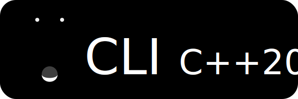

<!-- Badges. Suggest using https://badgen.net or https://shields.io -->

Base template for a C++20 Command-Line Interface (cli) program 

_**NOTE:** Though this repo can be used as-is, it is intended for use by the MoonHappy Project Generator utility._

# Overview

This repo consists of sample code and structure of a typical C++20 cli program. The MoonHappy Project Generator utility uses this base repo to then apply diff patches to customise the template for use with various build (cmake, buck2, etc..) and package management frameworks.

## Layout

- `/include` - public interface headers (.hpp) should be listed here.
- `/lib` - third-party libraries/submodules should be listed here.
- `/src` - source code (.cpp) and private headers should be listed here.
- `/test` - unit test files, using GoogleTest, should be listed here.
- `.gitignore` - GitHub based C++ ignore list.
- `LICENSE` - MIT license.
- `README.md` - this file explaining the repo contents.
- `TITLE.svg` - banner logo for the repo.

# Acknowledgements

_**NOTE:** Extend this section to acknowledge libraries, code, and contributors of the project._

- [Buck2](https://github.com/facebook/buck2) | Copyright (c) Meta Platforms, Inc. and affiliates.
- [GoogleTest](https://github.com/google/googletest) | Copyright (c) Google Inc.
- [CLI11](https://github.com/CLIUtils/CLI11) | CLI11 Copyright (c) University of Cincinnati, developed by Henry Schreiner under NSF AWARD 1414736.
- [all-contributors](https://allcontributors.org) | Copyright (c) 2016 Kent C. Dodds, 2019 Jake Bolam.

## Contributors

<!-- ALL-CONTRIBUTORS-LIST:START - Do not remove or modify this section -->
<!-- prettier-ignore-start -->
<!-- markdownlint-disable -->

<!-- markdownlint-restore -->
<!-- prettier-ignore-end -->

<!-- ALL-CONTRIBUTORS-LIST:END -->
